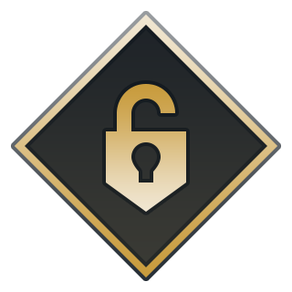

# ✨ LeagueSkins - League of Legends Skins Assets

<div align="center">
  
  
  [](https://github.com/AlbanCliquet/LeagueUnlockedReleases/releases/latest)
  [](https://discord.com/invite/cDepnwVS8Z)
</div>

---

## About

This repository contains a comprehensive collection of League of Legends skin assets, organized by champion and skin IDs. All assets are extracted and maintained by the **LeagueUnlocked** community.

**LeagueUnlocked** is a powerful tool that allows you to unlock and use any skin in League of Legends, including legacy, limited, and exclusive skins that are no longer available through normal means.

## Features

- **Complete Skin Collection** - Access to all League of Legends skins
- **Legacy & Limited Skins** - Unlock skins that are no longer available
- **Chroma Support** - Full chroma collections for applicable skins
- **Organized Structure** - Easy to navigate file organization
- **Regular Updates** - Constantly updated with new skins and patches

## Repository Structure

```
skins/
├── {champion_id}/
│   ├── {skin_id}/
│   │   ├── {skin_id}.png          # Skin preview image
│   │   ├── {skin_id}.zip          # Skin asset package
│   │   └── {chroma_id}/           # Chroma variants (if available)
│   │       ├── {chroma_id}.png    # Chroma preview image
│   │       └── {chroma_id}.zip    # Chroma asset package
│   └── {skin_id}/                 # Additional skins
│       ├── {skin_id}.zip
│       └── {chroma_id}/
│           ├── {chroma_id}.png
│           └── {chroma_id}.zip
```

### File Organization

- **Champion IDs**: Numeric identifiers (e.g., 1, 10, 101, etc.)
- **Skin & Chroma IDs**: Calculated as `champion_id * 1000 + skin_number` - can be 4, 5, or 6 digits (e.g., 1000, 10000, 100000)
- **File Types**: 
  - `.png` - Preview images
  - `.zip` - Complete skin asset packages

## Getting Started

1. **Download LeagueUnlocked**: Get the latest installer from our [releases page](https://github.com/AlbanCliquet/LeagueUnlocked/releases/latest)
2. **Install the Tool**: Follow the installation instructions
3. **Browse Skins**: Use this repository to preview available skins
4. **Apply Skins**: Use LeagueUnlocked to apply any skin in-game

## Community

Join our vibrant community for support, updates, and discussions:

- **Discord**: [Join our Discord server](https://discord.com/invite/cDepnwVS8Z)
- **Issues**: Report bugs or request features
- **Updates**: Stay informed about new releases

## ⚖️ Legal Notice

This project is for educational and personal use only. Please respect Riot Games' intellectual property rights and terms of service. LeagueUnlocked and this asset collection are not affiliated with or endorsed by Riot Games.

## License

This repository is open source. The skin assets are property of Riot Games and are used under fair use for educational purposes.

---

**Powered by [LeagueUnlocked](https://github.com/AlbanCliquet/LeagueUnlocked)**
